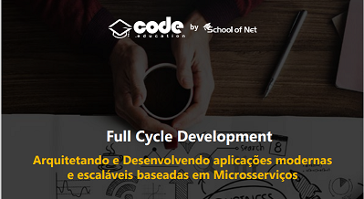

<p align="center">
  
</p>

<div align="center">


[](https://github.com/aimatama/CodeEdu-FullCycle2-Docker-DesafioGo/blob/master/LICENSE)<space> <space>

</div>

## 📑 Tabela de Conteúdos

- [Descrição do Exercício](#-Descrição-do-Exercício)
- [Sobre o Curso Full Cycle Development](#-Sobre-o-Curso-Full-Cycle-Development)
- [Screenshots](#-Screenshots)
- [Status do projeto](#-Status-do-projeto)
- [Tecnologias utilizadas](#-Tecnologias-utilizadas)
- [Como executar o projeto](#-Como-executar-o-projeto)
- [Licença](#-Licença)
- [Contato](#-Contato)

---

## 💬 Descrição do Exercício

Desafio Nodejs com NGINX.

Divirta-se.

---

## 💬 Sobre o Curso Full Cycle Development

O Curso Full Cycle Development da Code Education visa ajudar na prática programadores a desenvolverem as principais habilidades exigidas pelas empresas no mercado para que eles sejam capazes de trabalhar em projetos de grande porte com total confiança e desenvolvendo do jeito certo. Maiores informações em **[Maratona Full Cycle](https://pages.fullcycle.com.br/maratona-fullcycle-b2)**. Realizado em março de 2021.

---

## 🏁 Status do exercício

🏁 Finalizado!!! 🏆🏆🏆

---

## 🖥 Screenshots

<p align="center">
    
</p>

---

## 🚀 Tecnologias utilizadas

O projeto foi desenvolvido utilizando as seguintes tecnologias:

- [Docker](https://www.docker.com/)
- [Node.js](https://nodejs.org/en/)

---

## ▶️ Como executar o projeto

```
# Crie uma pasta para o projeto do exercício
> mkdir desafio-nginx-com-nodejs

# Acesse a pasta do repositorio
> cd desafio-nginx-com-nodejs

# Clone o repositório
git clone https://github.com/aimatama/CodeEdu-FullCycle2-Docker-DesafioNginx-com-NodeJs.git

# Execute os containers com o Docker Compose
> docker-compose up -d --build

# Acesse a aplicação no endereço http://localhost:8080/

```
---

## 📜 Licença

O projeto está sob a licença [MIT](./LICENSE) ❤️

---

## ☎️ Contato

Para falar comigo:
<br/><br/>
[](https://www.linkedin.com/in/aimatama/)
[](mailto:aimatama@gmail.com)
<br/>
Gostou do projeto? Deixe uma estrelinha para ajudar!!! ⭐
